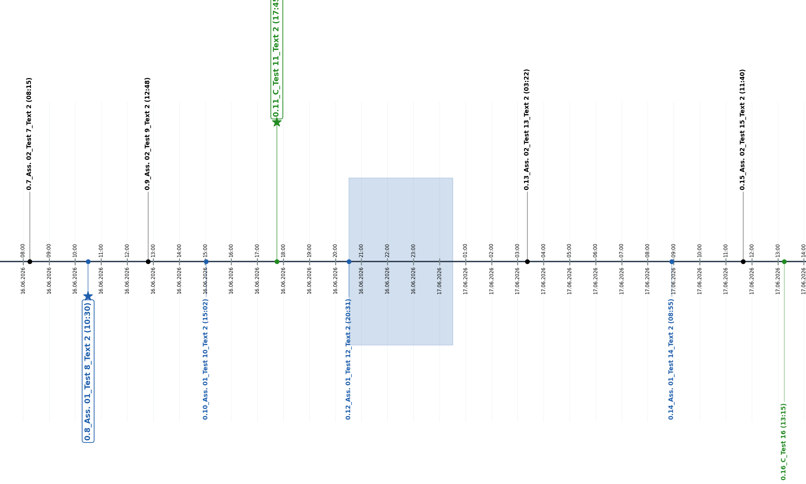
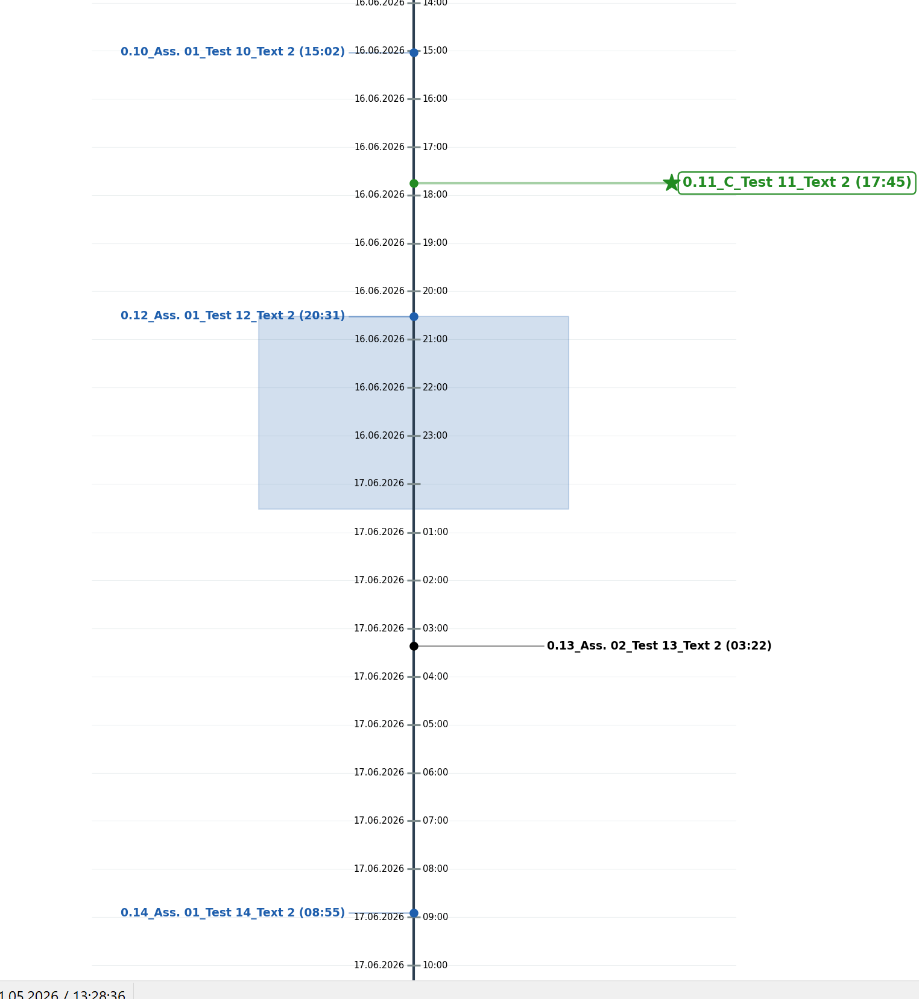

# Zeitstrahl /timeline

Python-Tool zur automatischen Erstellung von Zeitstrahlen aus einer Excel-Datei.  
Die Ausgabe erfolgt als PNG und/oder PDF — horizontal oder vertikal.

Python tool for automatically generating timelines from an Excel file.  
Output is PNG and/or PDF — horizontal or vertical.

---

## Screenshots

**Horizontal:**  


**Vertikal / Vertical:**  


---

## Voraussetzungen / Prerequisites

```
pip install openpyxl matplotlib
```

Eigenständige `.exe` (kein Python nötig) / Standalone `.exe` (no Python required):

```
pyinstaller --onefile --hidden-import matplotlib.backends.backend_agg --hidden-import matplotlib.backends.backend_pdf zeitstrahl.py
```

---

## Verwendung / Usage

1. `Zeitstrahl.xlsx` befüllen (siehe Struktur unten) / Fill in `Zeitstrahl.xlsx` (see structure below)
2. `zeitstrahl.py` oder / or `zeitstrahl.exe` ausführen / run
3. Ausgabe im Ordner / Output in folder `output/`

Dateiname / Filename: `YYYYMMDD_HHMMSS_Zeitstrahl_<Intervall>.png`

---

## Excel-Struktur / Excel Structure

Die Datei benötigt zwei Tabellenblätter / The file requires two sheets:

- **`Zeitstrahl_1`** — Ereignisse und Zeitspannen / Events and time ranges
- **`Einstellungen`** — Kategorien und Einstellungen / Categories and settings

---

### Blatt `Zeitstrahl_1` — Spalten / Columns A–I (ab Zeile / from row 2)

| Spalte / Column | Inhalt / Content |
|--------|--------|
| A | Startdatum / Start date |
| B | Startuhrzeit / Start time |
| C | Enddatum / End date (optional — fills a colored range if set) |
| D | Enduhrzeit / End time |
| E | Quelle / Source |
| F | Kategorie / Category (must be defined in `Einstellungen` column C) |
| G | Text |
| H | Zusatztext / Additional text |
| I | Wichtig / Important (`Ja` / `Nein`) |

Das Label eines Events setzt sich zusammen aus / Event label is built from: `Quelle_Kategorie_Text_Zusatztext`

Wenn Spalten C+D gesetzt sind, wird eine **farbige Zeitspanne** (Fläche) im Hintergrund gezeichnet statt eines einzelnen Ereignis-Markers / If columns C+D are set, a **colored time range** (filled area) is drawn in the background instead of a single event marker.

---

### Blatt `Einstellungen` — Kategorien / Categories (Spalten / Columns C–F, ab Zeile / from row 2)

| Spalte / Column | Inhalt / Content |
|--------|--------|
| C | Kategoriename / Category name |
| D | Farbe / Color (german: `rot`, `blau`, … or hex code) |
| E | Sichtbar / Visible (`Ja` / `Nein`) |
| F | Stem-Länge / Stem length (number, default: `2.5`) |

---

### Blatt `Einstellungen` — Einstellungen / Settings

| Zelle / Cell | Inhalt / Content |
|-------|--------|
| B2 | Tick-Intervall / Tick interval (`1h`, `30min`, `1d`, …) |
| G2 / H2 | Startdatum / Startzeit — Start date / time (empty = all data) |
| I2 / J2 | Enddatum / Endzeit — End date / time (empty = all data) |
| K2 | Uhrzeit im Label anzeigen / Show time in label (`Ja` / `Nein`) |
| L2 | Schriftgröße / Font size (`klein` / `small`, `normal`, `groß` / `large`) |
| M2 | Projektname / Project name |
| N2 | Ausrichtung / Orientation (`horizontal`, `vertikal`, `beides` / `both`) |
| O2 | Dateiformat / File format (`png`, `pdf`, `beides` / `both`) |
| P2 | Label-Seite / Stem side (`oben`, `unten`, `beides`) |

---

## Hervorhebung wichtiger Events / Highlighting Important Events

Events mit `Ja` in Spalte I / Events with `Ja` in column I:
- Stern-Symbol am Ende des Stems / Star symbol at the stem tip
- Fetterer, größerer Label-Text / Bold, larger label text
- Rahmen um den Label-Text / Box around the label text

---

## Zeitspannen / Time Ranges

Zeilen mit einem gesetzten Enddatum (Spalte C) werden als **farbige Fläche** im Hintergrund des Zeitstrahls dargestellt. Die Farbe richtet sich nach der Kategorie. Zeilen ohne Enddatum werden als normale Ereignis-Marker gezeichnet.

Rows with an end date (column C) are rendered as a **colored background area** on the timeline. The color is taken from the category. Rows without an end date are drawn as regular event markers.

---

## Unterstützte Farbnamen / Supported Color Names

`schwarz`, `rot`, `grün`, `blau`, `gelb`, `orange`, `lila`, `violett`, `pink`, `rosa`, `grau`, `braun`, `cyan`, `magenta`, `weiß`

Alternativ / Alternatively: beliebiger Hex-Code / any hex code (e.g. `#FF5733`)
